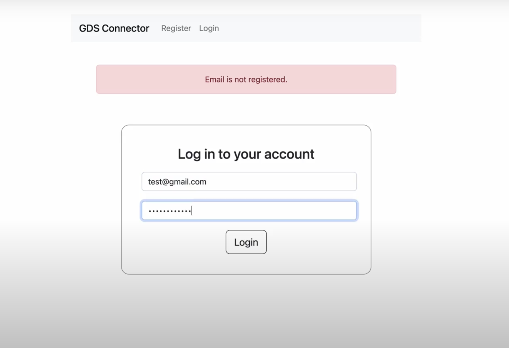
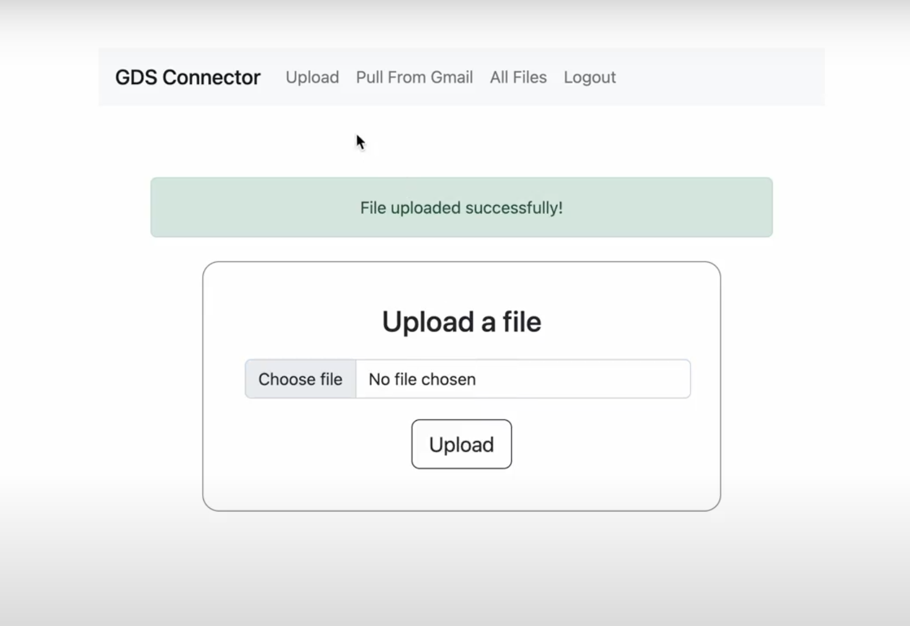
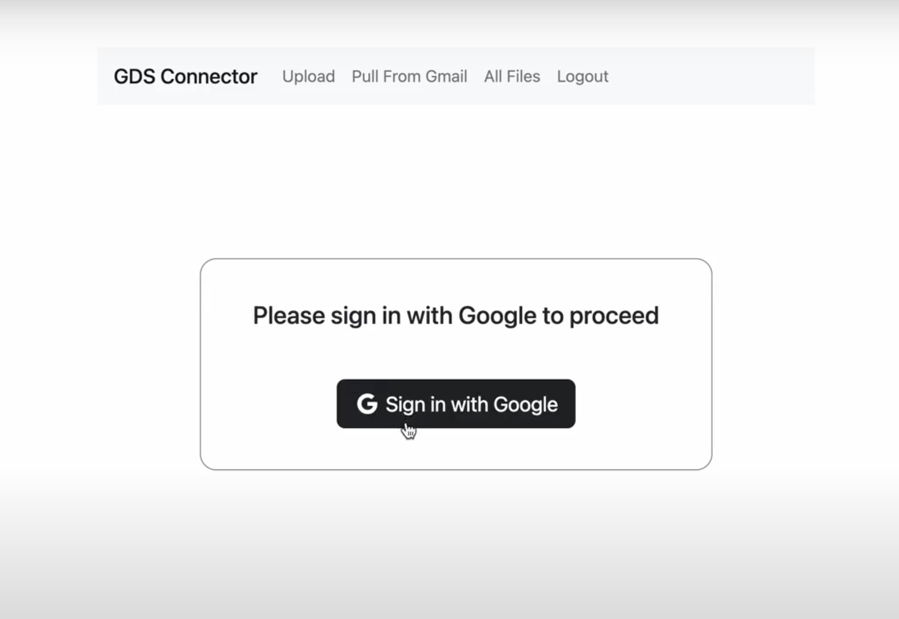
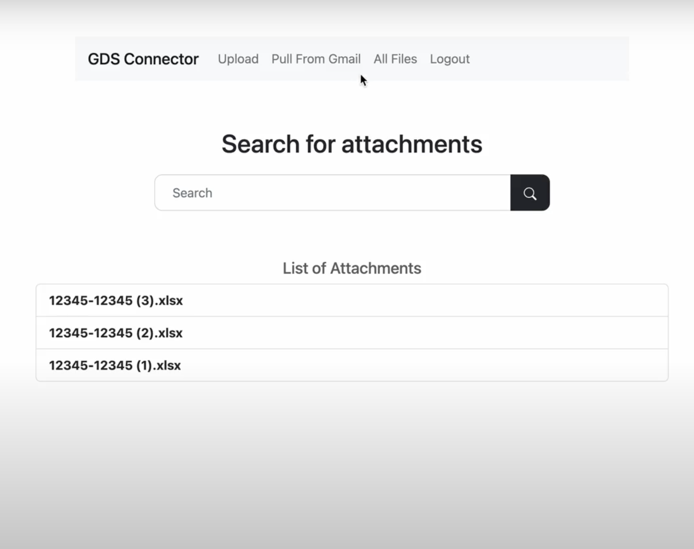
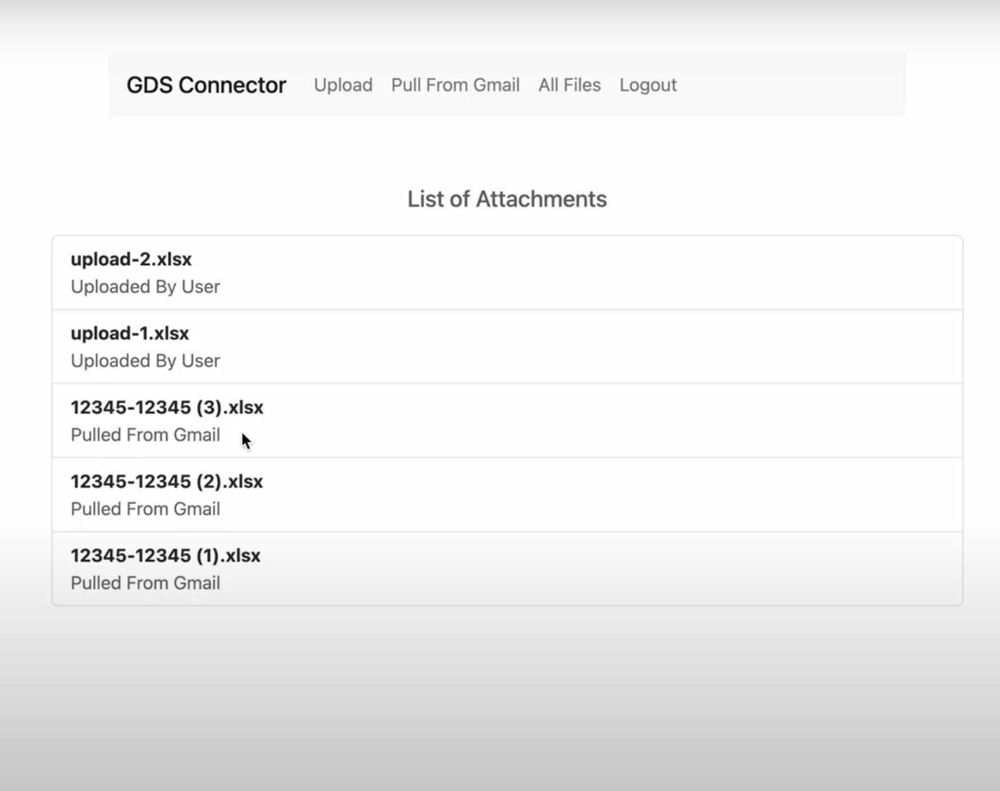
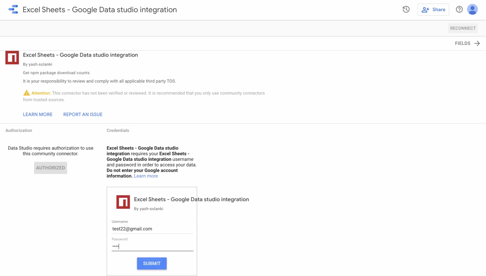
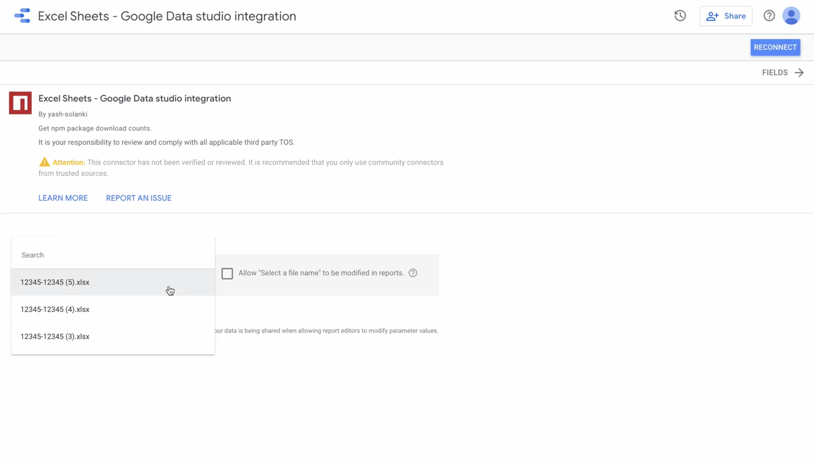

## About Google Data Studio
Google Data Studio is an online tool for converting raw data into customizable informative reports and dashboards

## About the Project
- A Google Data Studio connector which can be used to connect to any excel file and create reports from it.
- The connector is built using Google Apps Script and Nodejs.
- The user can register/login using email and password and upload a file from the computer or can login using Google OAuth and get all the files from his/her Gmail account based on a search query.
- All the uploaded files will be stored in a MongoDB database and can be used to create reports in Google Data Studio.

## UI Snapshots
### Nodejs App

### Google Data Studio Connector

### Initial Setup
- Git clone repo
- Run `npm i` to install all the dependencies
- Create a `files` folder in the root of the repo. All the uploaded files will be stored here.
- Create a cluster in mongodb and copy paste the url inside the `.env` file
- Also, add a secret key for your session in the same file

### Setting up project in Google Cloud
- Go to [Google Cloud Console](https://console.cloud.google.com) and create a new project
- Enabling Google API
    - In sidemenu options, select `APIs and Services` -> `Library` -> Search for `Gmail API` and enable it
- Setting up the OAuth Screen
    - Inside `APIs and Services` -> `OAuth Consent Screen` -> Select `User Type` (Select `External` for testing) and click on `Create`
    - Now enter all the application details and click `Save and Continue`
    - Inside `Scopes` section -> `Add Scopes` -> Seach for `Gmail API` and select the `/auth/gmail.readonly` scope. This gives our app access to read the user's emails -> `Save and Continue`
    - If your application is still in `Testing` phase and you selected `External` user type in Step 1, you'll have to provide email ids of all the users who can access your app -> `Save and Continue`
    - Check the app summary and click `Save`
- Generating Credentials
    - Again in `APIs and Services`, select `Credentials` -> `Create Credentials` -> `oAuth Client ID`
    - Select `Application Type` (Web Application), add authorized origin (Use `http://localhost:4000` if you don't have a Domain) and a callback URL where Google will send the response after OAuth (`http://localhost:4000/auth/google/callback` in our case). Also add this as `CALLBACK_URL` in the `.env` file
    - Save you client id and secret as `GOOGLE_CLIENT_ID` and `GOOGLE_CLIENT_SECRET` in the `.env` file

### Running the Node App
- Go to `http://localhost:4000/register` and create an account and/or login to your account
- Here, you can upload the excel files you wish to use as data source in the connector.
- To view all the files uploaded by you, select the `All Files` option from the navbar

### Setting up the connector code in Google Apps Script
- Go to [Google Apps Script](https://script.google.com) and create a new project
- Some features are not yet available in the new ui of apps script. Click on `Use classic editor` to switch to the older view.
- Click on the file name and rename the current file from `Code.gs` to `Auth.gs` and paste the code from the same file inside `scripts` folder in this repo.
- Now, select `File` -> `New` -> `Script file` -> and name the file as `Main.gs` and paste the code from the `scripts` folder
- For viewing the manifest file,  select `View` -> `Show Manifest file` and you'll see a file named `appsscript.json` in sidemenu. You can use the content of the same file from inside the `scripts` folder or make changes as needed

### Setting up ngrok
- Since our connector code is running in [Google App Scrips](https://developers.google.com/apps-script), we need to make our node app is also available on the internet, so we're using ngrok. It basically hosts our localhost on a url which can be accessed from anywhere.
- Install [ngrok](https://ngrok.com/) in your system and run it using `ngrok http <port>`.
- You'll see a custom url, switch to your Apps Script project and assign this value to `ROOT_URI` on line 1 in `Auth.gs`

### Publishing the connector
- Now, to publish the connector, click on `Publish` -> `Deploy From Manifest` -> Click on `Latest Version (Head)`, you'll see a link to data studio
- Open it in a new tab, since this is a test connector, you may have to login once with your google account. 
- After logging in with google, you'll see the connector username password auth screen. Here, you can login with the registered creds from the Nodejs app
- In the next screen, you'll be asked to select a file name which will act as a data source. Here, you should be able to see all the files uploaded in the nodejs app.
- Select a file and click on `Connect` in the top right
- On the next page, you'll see the schema of the file and click on `Create Report` to create a new report in Google Data Studio
- A new report with the selected file as a data source has been created. You can add visualizations and make changes to the report.

### Contact information
Please feel free to reach out to me at `yashsolanki1709@gmail.com` in case you have any queries.